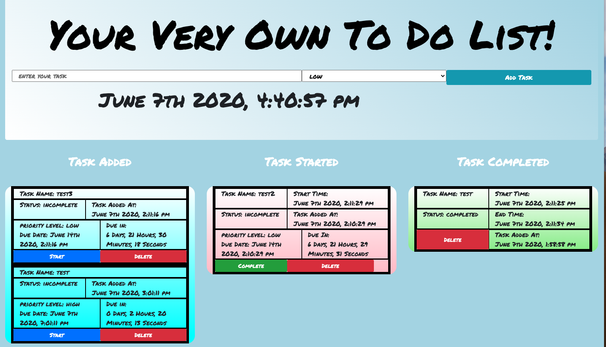
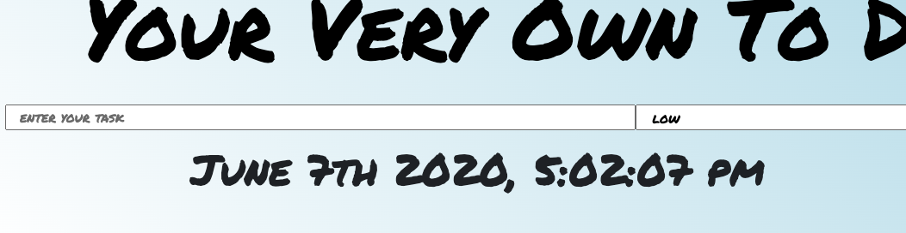
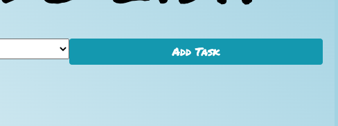
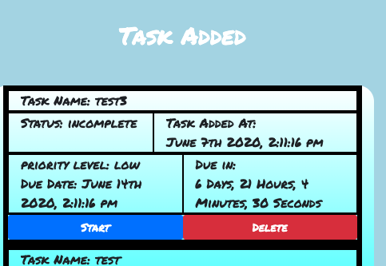
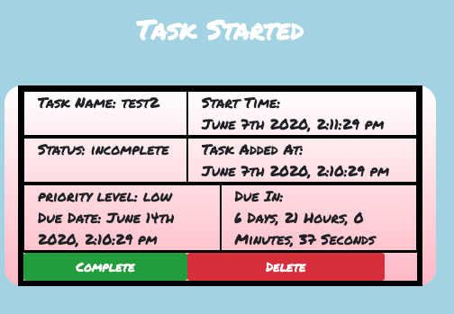
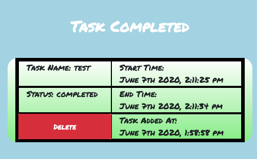
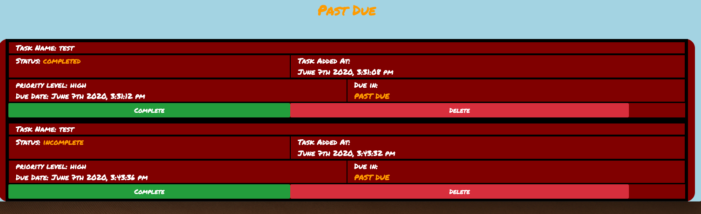
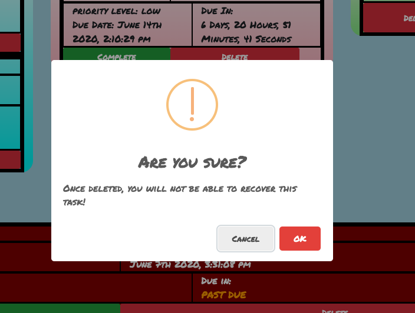
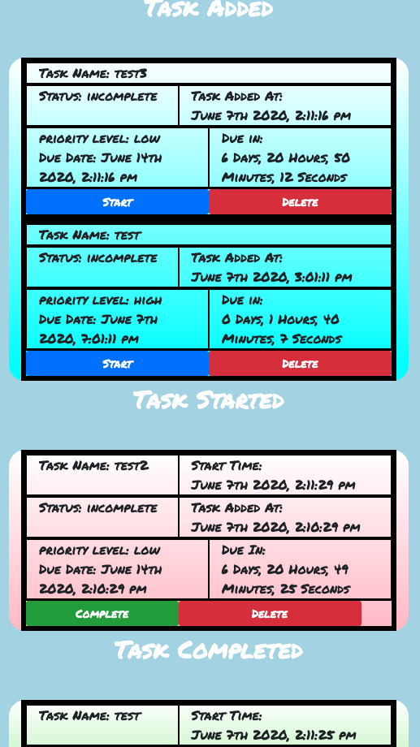

# To Do List App 2.0

A simple to do list used to keep track of daily or weekly tasks. Comes complete with a built in clock, a due date generated based on priority level, and a count down timer that counts down to the due date. 4 columns exist where each task gets sorted based on the following conditions: "added but not started", "started but not completed", "completed" , and "past due". These are auto sorted for you based on the status of each task. This app is also mobile friendly and can be used on any mobile device.

## Languages used

This app was built using the following coding languages and libraries 

-HTML
-CSS
-JavaScript
-JQuery
-Node.JS
-Express
-Bootstrap
-Sweet Alerts
-Moment.JS
-PG
-SQL
-Google Fonts
-Ajax

### Sample picture

#### Instructions

1. enter a task by typing your task in the shown input field, then choose a priority level with the drop down menu.

2. then click "add task" or push your enter key on your keyboard.

3. Now you can choose to start your task by pushing the "start" button or delete it by pushing the "delete" button. You will see the priority level listed as well as the due date, how long you have to complete the task, and the day and time the task was added. You will also see your task's status. It should say "incomplete" at this point.

4. Any task you start will get moved to the middle column labeled "task started". You will see the same information as before, except you will see a "complete" button that replaces the "start" button. You will also see a start time along side the time the task was added. Click "complete" to complete your task

5. Once a task is marked as complete it gets moved over to the complete section. Here you can review your task. You will see the status marked as complete and the time the task was completed.

6. If a task due time runs out, your task gets moved to the past due section. These tasks can still be completed, but once a task gets moved here it never leaves unless it is deleted.

7. To delete a task, click the delete button on any of the tasks at any time. A confirmation window will pop up, once the deletion is confirmed your task will disappear from the screen.

8. The to do list is 100% mobile friendly and will adjust to the size of any device.

